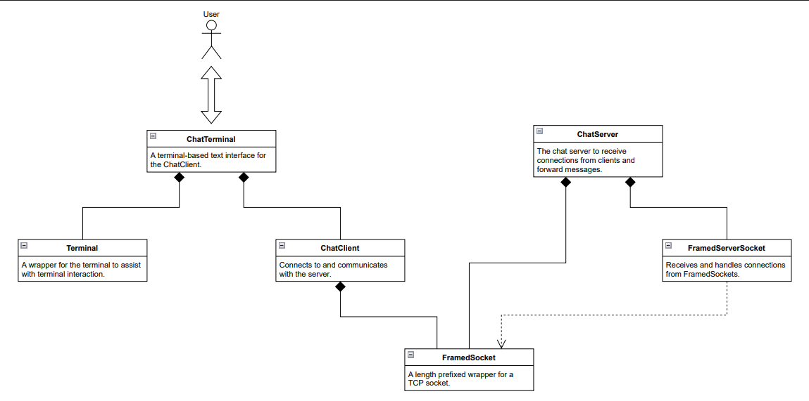

# Chatroom



## Setup

First, open a few terminals and navigate to the `\Chatroom` directory.
It's recommended that you do this in a terminal outside pycharm (such as powershell or cmd prompt) otherwise it'll mess with the way the output is formatted.
Resizing the terminal while the script is running may mess with formatting.

### Server

To start the server, simply run `server_start_script.py` in one of the terminals:

```commandline
py .\server_start_script.py
```

### Client

To start a client, simply run `client_start_script.py` in one of the terminals:

```commandline
py .\client_start_script.py
```

## Info

The server reads on `15001` and writes on `15002` by default but this can be changed in `config.py`.

## Usage

### Username

Before you can do anything, you must enter a username. The username has to be alphanumeric.

```
Please enter a username: MyUsername123
```

Then you will see the instructions

```
Please enter a username: MyUsername123

You have entered the chatroom!
Press enter at any time to begin inputting a message.
Preface a message with @example to send a private message to the user with the username 'example'.
Private messages to you are indicated with the separator '->' and the color purple.
Send !exit to leave the chatroom.
```

Below this your cursor will be blinking. In order to send a message, you must press enter, input your message, then press enter again.

### Broadcast

1. First press enter.
2. An arrow `>` should now be at the beginning of the line.
3. Type any text.
4. Press enter.
5. The message has been sent and should be displayed on every client's screen.

### Private

1. First press enter.
2. An arrow `>` should now be at the beginning of the line.
3. Type `@username message` where username is the username of the client you want to send a private message to and message is the message you want to send to that user.
4. Press enter.
5. The message has been sent and should be displayed on your screen as well as the screen of the client with that username.

### Exit

1. First press enter.
2. An arrow `>` should now be at the beginning of the line.
3. Type `!exit`.
4. Press enter.
5. The client has now exited the chatroom. An exit message should be displayed on all clients.

Alternatively, you can just press CTRL+C. It works the same.

## Examples

Bob wants to join the chatroom. Bob starts the client and is prompted for their username.

```
Please enter a username: 
```

Bob enters Bob:

```
Please enter a username: Bob
```

Bob presses enter and is greeted by the instructions and his cursor sitting below them:

```
Please enter a username: Bob

You have entered the chatroom!
Press enter at any time to begin inputting a message.
Preface a message with @example to send a private message to the user with the username 'example'.
Private messages to you are indicated with the separator '->' and the color purple.
Send !exit to leave the chatroom.

<-- Bob's cursor is here
```

Bob now reads the instructions and presses enter. An arrow appears with his cursor to the right of it:

```
> 
```

Bob inputs a message:

```
> Hey everyone
```

Bob presses enter and the message is replaced with a formatted version:

```
Bob >> Hey everyone
<-- Bob's cursor is here
```

Alice responds to Bob:

```
Bob >> Hey everyone
Alice >> Hey Bob!
<-- Bob's cursor is here
```

Bob presses enter:

```
Bob >> Hey everyone
Alice >> Hey Bob!
> 
```

Bob enters a private message to Alice:

```
Bob >> Hey everyone
Alice >> Hey Bob!
> @Alice Hi Alice! This is a private message!
```

Bob presses enter and the message is formatted:

```
Bob >> Hey everyone
Alice >> Hey Bob!
Hi Alice! This is a private message! -> Alice
<-- Bob's cursor is here
```

Alice responds:

```
Bob >> Hey everyone
Alice >> Hey Bob!
Hi Alice! This is a private message! -> Alice
Alice -> Hi Bob! This is another private message!
<-- Bob's cursor is here
```

Bob needs to leave, he presses enter:

```
Bob >> Hey everyone
Alice >> Hey Bob!
Hi Alice! This is a private message! -> Alice
Alice -> Hi Bob! This is another private message!
> 
```

He enters `!exit`:

```
Bob >> Hey everyone
Alice >> Hey Bob!
Hi Alice! This is a private message! -> Alice
Alice -> Hi Bob! This is another private message!
> !exit
```

He presses enter and leaves the chatroom:

```
Bob >> Hey everyone
Alice >> Hey Bob!
Hi Alice! This is a private message! -> Alice
Alice -> Hi Bob! This is another private message!
Bob left the chat.
```
